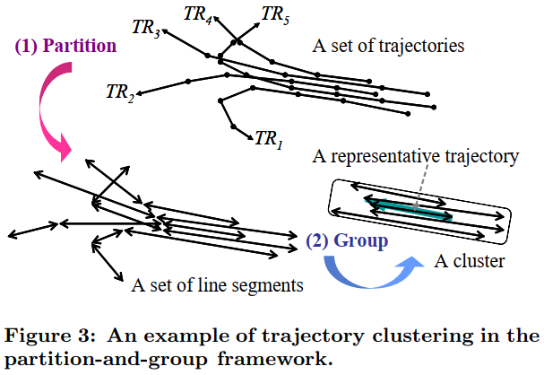
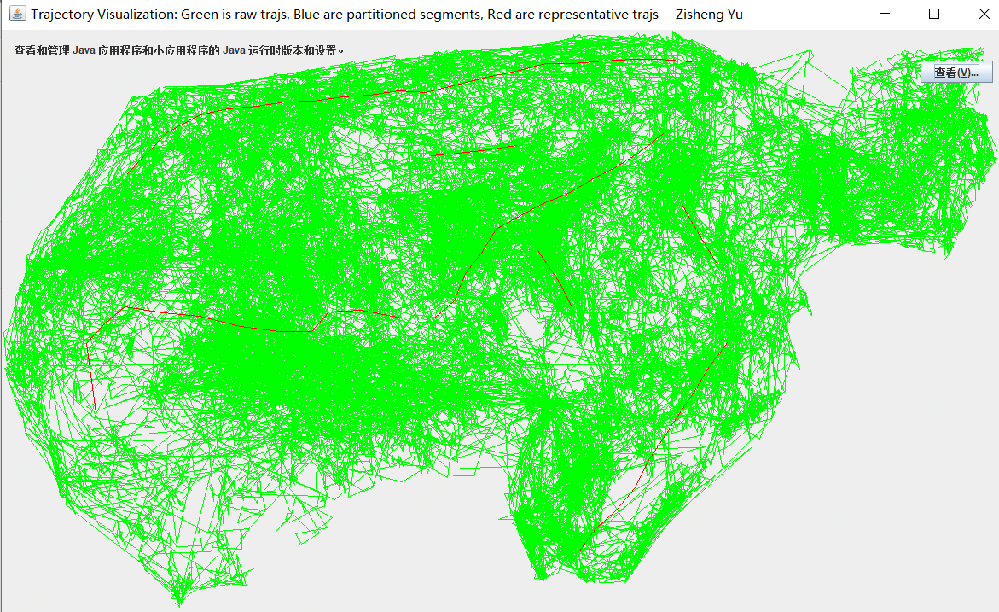

# Trajectory Cluster

> This repository is the implementation in Java for the paper "[Trajectory clustering: a partition-and-group framework](https://dl.acm.org/doi/abs/10.1145/1247480.1247546)" of 2007 ACM SIGMOD.

This framework of trajectory cluster including three parts: trajectory partition, segment cluster, and representative trajectory computing.

+ Trajectory Partition: Compress trajectory using minimum description length (MDL) principle and convert it to a set of segments.
+ Segment Cluster: Cluster segments using DBSCAN algorithm.
+ Representative Trajectory Computing: Compute the representative trajectory for each cluster using sweep line algorithm.

To see the following result , run `TrajectoryClusterTest.java` directly.

